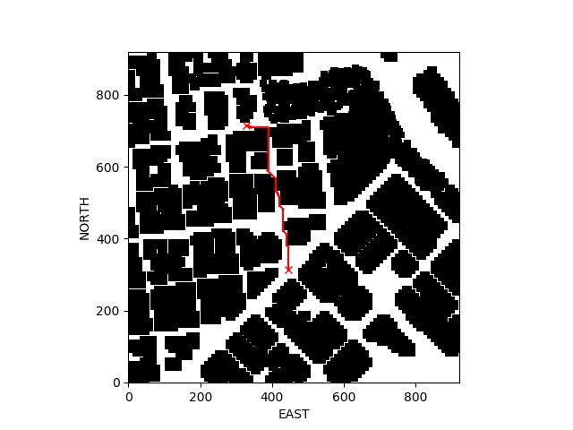
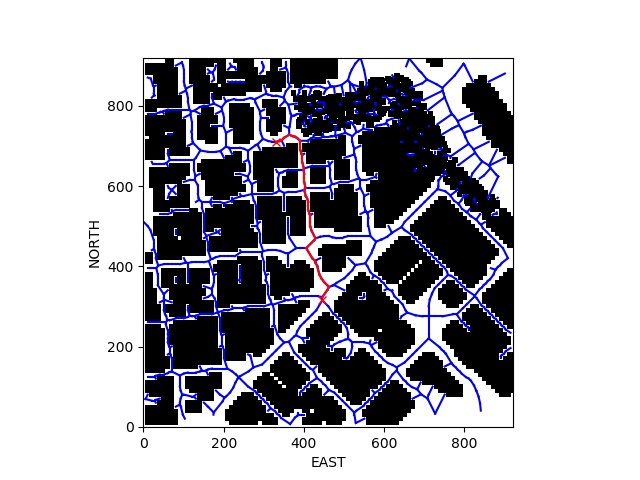

# FCND - 3D Motion Planning

## SETUP AND RUNNING
 - to run : >python motion_planning.py [options]
 - command line options: 
 - --mode [voronoi | grid ]
   - select planning mode
   - default is grid if --mode is not specified
- --plot
   - if specified, a plot of the grid and path is generated
   - note: generating the plot takes a long time and can result in a network timeout. if that occurs just use
   --plot to get the plot then rerun without it to 
   see the flight. The plot is saved to disk in the
   current directory.
- programmatic options
  - set self.waypoint_tolerance to control when to perform a waypoint transition
  - set self.loiter_seconds to a value > 0 to have the drone loiter at waypoints
    5 or more seconds seems to be needed to compensate for the overshoot

## FILE ORGANIZATION
 - motion_planning.py : 
   Contains the updated main code for the drone including both grid and voronoi planners
 - planning_utils.py : 
   As provided with some small modifications that are marked with comment
 - project_utils.py : 
   New file with various utilities in support of motion_planning.py
 - plot_log.py : 
   offline utility that reads the telemetry output of the flight and generates plots. The
   telemetry log TLog.txt is read  at the conclusion of a flight and written to 'log.pkl' as a pickle file for offline plotting.

## GRID SEARCH APPROACH
The grid search mode is build on the provided example, just
adding the required features to have a variable start and
goal position. It uses the standard a_star grid search
function. This mode takes a while to generate the path 
so some progress information is printed while the a_star 
algorithm runs. 

Example Grid Search

## VORONOI GRAPH APPROACH
The voronoi mode uses a Voronoi graph and modified a_star graph
search to find the path. It runs much quicker than the grid search,
so it does not print a_star progress information. 

Example Voronoi Search

## DIAGNOSTICS
This is an example of the diagnostic printout when the simulation runs:
<pre>
Logs/TLog.txt
mode = GRID_SEARCH                                           (search mode)
Logs/NavLog.txt                                 
starting connection                                           
arming transition
Searching for a path ...
global home [-122.3974533   37.7924804    0.       ]         (compute positions)
global_position [-122.3962654   37.794106     0.219    ]      "
local position [180.66429138 105.60977936  -0.22151029]       "
current_position [181.03458043 103.42442738  -0.219     ]     "
North offset = -316, east offset = -445                      (grid offsets)
Local Start and Goal:  (497, 548) (716, 329)                 (start and goal position)
Printing Astar Progress (every 1000 iterations)              (a_star progress)
0 0 (497, 548)                                               (iteration, cost, position)
1000 334 (573, 53    
...
Found a path.
Path 380:407.580736 : Pruned Path 30                         (path info)
Sending waypoints to simulator ...
ET: 29.746826                                                (elapsed time to plan)
takeoff transition [0. 0. 5.]                                 

</pre>
## ENHANCEMENTS

### Deadband
A parameter is added to the MotionPlanner object called self.waypoint_tolerance. This
sets the raidius for detecting arrival at a waypoint. 

### Heading Commands
 - The Voronoi mode has heading control implemented. It was not added to the grid search mode
to provide a comparison of the results. The drone should point towards the next waypoint
while flying.

### Loiter
 - A parameter is added to the MotionPlanner object called self.loiter. If this parameter
is greater than 0, the drone will loiter at each waypoint for the specified number of seconds.
A value of 5 or greater gives best results. Less than 5 and the drone just stutters and then
continues. This makes a flight a lot longer so don't enable it unless you need it.

## TESTING
 - The program was tested on both Windows and Linux. There were more frequent network timeouts
and aborts when running on Windows. No problems were found running on Linux (once I fixed my
own bugs).  

### Observations
 - The drone flies a bit too fast to adhere to the planned path. Sharp turns exhibited a lot
of overshoot. The default fly-to-the-waypoint behavior is not ideal for generating a 
smooth flight. The overshoot can cause contact with obstacles. One fix would have the controller slow the drone down on approach to a waypoint and then accelerate once it
passes the waypoint. The decel/accel could be scaled to the magnitude of the turn direction. Or maybe ramp the north and east velocity terms in the direction of the next waypoint. 

#### Grid Search
  - The grid search mode flies very close to the obstacles, as expected since it is trying
 to find the shortest path. With the resulting overshoot the vehicle comes very
 close to colliding with the obstacles. On the positive side, the grid search generates
 a path that is amenable to pruning so that the number of waypoints is significantly
 reduced, resulting in a bit smoother flight (if it doesn't hit a wall).
#### Voronoi
 - The voronoi mode generates a path with more obstacle clearance than the grid search, as expected. This eliminates most near-miss with obstacle incidents, with the exception of some
sharp turns when obstacles are close together. The disadvantage of this mode is that
the path doesn't generate as many collinear waypoints, so that pruning doesn't help much and the flight path appears jerkier. 